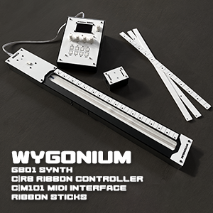
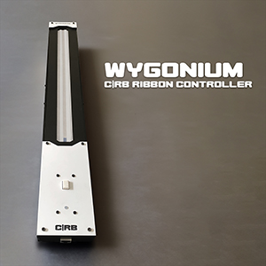
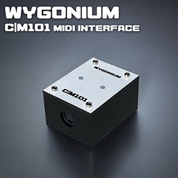
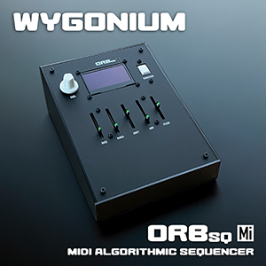

# Wygonium C|RB Ribbon Controller

## Info

- 450mm of pitch and pressure touch input
- Capacitive touch button to toggle pitch quantization or sustain (drone) mode
- Right or left handed operation, configurable in GB01
- Reversable pitch orientation
- Magnetic "Ribbon Sticks" serve as pitch location reference
    - Come in 1, 2, and 3 octave formats

## Demo Video

Used with the GB01

<iframe width="560" height="315" src="https://www.youtube.com/embed/F4Fk_X3j23E?si=3ApcUsWsLcP-X0Cu" title="YouTube video player" frameborder="0" allow="accelerometer; autoplay; clipboard-write; encrypted-media; gyroscope; picture-in-picture; web-share" referrerpolicy="strict-origin-when-cross-origin" allowfullscreen></iframe>

## Details

#### Hardware 

- 500mm SpectraSymbol SoftPot with female connector
- 600mm pressure-sensitive strip (generic from Amazon)
- VCC illuminated capacitive touch switch
- RJ45 Ethernet jack
- Custom circuit boards
- Several resistors

#### Other Stuff

"C|RB" has two meanings/references:
- "Controller RiBbon"
- The name of my band, cut.rate.box (c.r.b)

The name "Ribbon Sticks" is a funny homage to the Ian Dury and the Blockheads song "Hit Me With Your Rhythm Stick" (which I'm not a big fan of, but it's a damn catchy song)

Early prototypes of the ribbon sticks

The back of the ribbon sticks are also laser-engraved and painted (here before all the protective paper has been peeled off)

I had made a version of the Ribbon Controller using a Sensel Touch pressure-sensitive pad (including a ribbon stick-like overlay), but they don't make the Touch pads anymore and I seemingly got the last "developer cable", it wasn't really a good path forward.

__________

<table align="center">
    <tr valign="top">
        <td align="center" width="150px" valign="top">
<h4 id="wygonium-intro"><a href="/Wygonium-Info/">Wygonium Intro</a></h4>
</td>
        <td align="center" width="150px" valign="top">
<h4 id="gb01-synth"><a href="/Wygonium-Info/WygoniumGB01.html">GB01 Synth</a></h4>
</td>
        <td align="center" width="150px" valign="top">
<h4 id="crb-ribbon-controller"><a href="/Wygonium-Info/CRBController.html">C|RB Ribbon Controller</a></h4>
</td>
        <td align="center" width="150px" valign="top">
<h4 id="m101-midi-input"><a href="/Wygonium-Info/WygoniumM101.html">M101 MIDI Input</a></h4>
</td>
        <td align="center" width="150px" valign="top">
<h4 id="orbsq-algorithmic-sequencer"><a href="/Wygonium-Info/WygoniumORBsq.html">ORBsq Algorithmic Sequencer</a></h4>
</td>
        <td align="center" width="150px" valign="top">
<h4 id="orbsqmi-midi-algorithmic-sequencer"><a href="/Wygonium-Info/WygoniumORBsqMi.html">ORBsq Mi MIDI Sequencer</a></h4>
</td>
    </tr>
</table>
