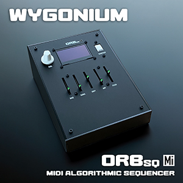

# Wygonium Synth Info

When a close friend, and fellow musician, jokingly asked me to 3D print him a long-forgotten German music synthesizer from the 1930s, I laughed. 

And then I made him one.

## The Story

Almost 100 years after its inception, I re-imagined Friedrich Trautwein's Trautonium synthesizer as a 21st century performance instrument, transporting this old relic into modern times, and in under two months shipped my friend the first Wygonium synth kit. Along with the core synthesizer, the kit included bespoke, modular accessories like a pressure-sensitive ribbon controller, MIDI interface module, and magnetic "ribbon sticks" (indicators of pitch on the ribbon). Six months later, I began porting an old project of mine from other platforms to the Wygonium Kit - my ORBsq Sequencer - an algorithmic sequencer that generates evolving musical patterns. 

While 3D printing did play a role, bringing my friend's "wild idea" into reality also involved user, social, and cultural research, circuit design, industrial design, electronics evaluation and sourcing, milling PCB prototypes, outsourcing final PCBs to China, UI/UX design, developing firmware, laser cutting, soldering, and designing and printing a "quick start" guide on <gulp> paper, all done in my garage-turned-workshop. Phew!

Having dedicated my career to pushing the boundaries of human-computer interaction, delving into such a rich "for fun" project was a delightful extension. It wasn't just about creating a synth; it was about re-thinking how we could make music, what music means as communication, and simply immersing myself in an end-to-end creative process. Refining existing skills, learning new tricks, aligning hardware and software to perfection—every step contributed to crafting an unparalleled experience.

Understanding the complete journey of product creation and use is a critical trait, IMO. It sharpens design decisions, facilitates seamless collaboration with partners and experts, and enables crystal-clear communication of expectations from concept to end-user experience. In a team setting, this awareness becomes a strategic advantage, guiding when to be flexible, when to push boundaries, and when to acknowledge non-negotiable limits. You don't have to be an expert in everything, but awareness goes a long way.

The beauty of this project's journey is that this elaborate process unfolded in a garage, powered by common maker tools, a handful of YouTube videos, and the wealth of knowledge within the online community. It echoes a sentiment I shared in a talk I gave at SXSWi almost 12 years ago: there has never been a better time to turn ideas into reality! The power to create, innovate, and shape the future is within reach, even in the most unassuming spaces.

## The Devices

Click a component to learn more.

<table align="center">
    <tr>
        <td align="center"><h3 id="gb01-synth"><a href="/Wygonium-Info/WygoniumGB01.html">GB01 Synth</a></h3>

</td>
        <td align="center"><h3 id="crb-ribbon-controller"><a href="/Wygonium-Info/CRBController.html">C|RB Ribbon Controller</a></h3>

</td>
    </tr>
    <tr>
        <td align="center"><h3 id="m101-midi-input"><a href="/Wygonium-Info/WygoniumM101.html">M101 MIDI Input</a></h3>

</td>
        <td align="center"><h3 id="orbsq-algorithmic-sequencer"><a href="/Wygonium-Info/WygoniumORBsq.html">ORBsq Algorithmic Sequencer</a></h3>

</td>
    </tr>
    <tr>
        <td align="center"><h3 id="orbsq-mi-sequencer"><a href="/Wygonium-Info/WygoniumORBsqMi.html">ORBsq Mi MIDI Algorithmic Sequencer</a></h3>

</td>
        <td align="center"></td>
    </tr>
</table>
