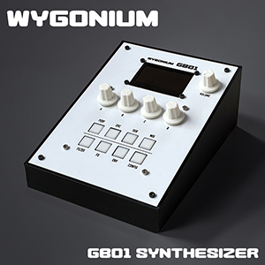
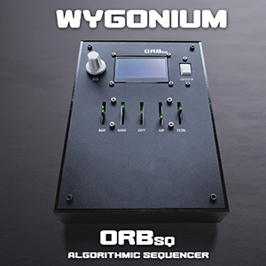

# Wygonium GB01 Synth

## Info

- 6 oscillators each with 7 waveforms (from pristine classics to lo-fi vintage digital synths)
    - 2 primary oscillators with independent adjustment ±12 semitones 
    - 4 “subharmonic” oscillators with selectable divisions (1-24) of the played pitch
    - Global detune for huge sounds
- Noise generator
- 4 independent parallel resonant bandpass filters with LFO modulation
- Adjustable LFO with 6 waveforms and touch restart
- Effects:
    - Drive, from subtle warmth to harsh overtones
    - Atmospheric stereo plate reverb
    - Lush stereo chorus
    - Looping digital delay with in/out for overdubs
- Flexible mixing stages
- Selectable velocity curves
- Pitch quantization
- Latched sustain
- One-shot or looping envelope
- Preset storage
- Pitch input quantization to musical scales, with root note setting

## Demo Video

<iframe width="560" height="315" src="https://www.youtube.com/embed/F4Fk_X3j23E?si=3ApcUsWsLcP-X0Cu" title="YouTube video player" frameborder="0" allow="accelerometer; autoplay; clipboard-write; encrypted-media; gyroscope; picture-in-picture; web-share" referrerpolicy="strict-origin-when-cross-origin" allowfullscreen></iframe>

<iframe width="560" height="315" src="https://www.youtube.com/embed/BMVRjA-401U?si=fLV2b4OPoMJ53w9m" title="YouTube video player" frameborder="0" allow="accelerometer; autoplay; clipboard-write; encrypted-media; gyroscope; picture-in-picture; web-share" referrerpolicy="strict-origin-when-cross-origin" allowfullscreen></iframe>

## Details

#### Hardware 

- Teensy 4.1
- Teensy Audio Board
- 2.42" OLED display (SSD1309)
- 4x Bourns rotary encoders
- 1x 10k audio taper potentiometer
- 8x NKK 12mm tactile buttons
- Jacks:
    - 2x 1/4" audio
    - 1x 1/8" headphones
    - 1x 2.1mm DC power
    - 1x RJ45 Ethernet
- 1x Power switch
- Custom circuit boards
- 2x CD4051 (for encoders)
- 1x 74HC165 (for buttons)
- 6x 3D-printed knobs
- Miscellaneous passives

#### Software

- The usual, standard Teensy/Arduino libraries
- Additional Teensy audio libraries (most slightly modified to get specific parameters):
    - Ensemble by Alexander Davis/[Vince R. Pearson (ElectroTechnique)](https://github.com/ElectroTechnique/TSynth-Teensy4.1) 
    - Plate Reverb by [Piotr Zapart (hexefx)](https://github.com/hexeguitar/hexefx_audiolib_F32)
    - Delay10Tap [from Teensy forum user HOUTSON](https://forum.pjrc.com/index.php?threads/can-i-modulate-the-delay-time.61513/post-265954)
- Custom Teensy audio libraries
    - Analysis to Variable to track LFO
    - Added restart() method to Waveform class to retrigger when used as LFO
- 12AX7 Tube response curve [from Teensy forum user HOUTSON](https://forum.pjrc.com/index.php?threads/teensy-based-multistage-distortion-modeling-pedal.44061/post-229555)
- Three waveforms used from [Adventure Kid Waveforms (AKWF)](https://github.com/KristofferKarlAxelEkstrand/AKWF-FREE)

#### Other Stuff

"Wygonium" is obviously(?) a tongue-in-cheek reference to the Trautonium this synth is modelled after, that having been named after the creator's last name of Trautwein.

"GB" are the initials of the friend that I built the synth for.

A sample of the Quick Start guide I made (click to enlarge)

The overall architecture diagram I made to explain how things fit together. It looks nice, but isn't terribly useful IMO. (click to enlarge)

Here's the very first GB01 I made, but thought the shape was too much like existing devices (e.g.: Blofeld, Elektron machines, et al)

I really wanted the GB01 to be in a vertical orientation, but ergonomically and functionally it was not a good option. Sadly.

What's inside a GB01? At least the non-cool tactile button GB01. 😉 (Note, the ridiculously long cables are for testing only; the final devices have used much, much shorter cables.)

Early version (1.2) of the main PCBs in the GB01. (Final PCBs are version 1.5)

__________

<table align="center">
    <tr valign="top">
        <td align="center" width="150px" valign="top">
<h4 id="wygonium-intro"><a href="/Wygonium-Info/">Wygonium Intro</a></h4>
</td>
        <td align="center" width="150px" valign="top">
<h4 id="gb01-synth"><a href="/Wygonium-Info/WygoniumGB01.html">GB01 Synth</a></h4>
</td>
        <td align="center" width="150px" valign="top">
<h4 id="crb-ribbon-controller"><a href="/Wygonium-Info/CRBController.html">C|RB Ribbon Controller</a></h4>
</td>
        <td align="center" width="150px" valign="top">
<h4 id="m101-midi-input"><a href="/Wygonium-Info/WygoniumM101.html">M101 MIDI Input</a></h4>
</td>
        <td align="center" width="150px" valign="top">
<h4 id="orbsq-algorithmic-sequencer"><a href="/Wygonium-Info/WygoniumORBsq.html">ORBsq Algorithmic Sequencer</a></h4>
</td>
    </tr>
</table>
