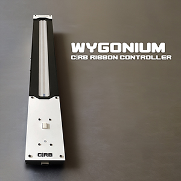
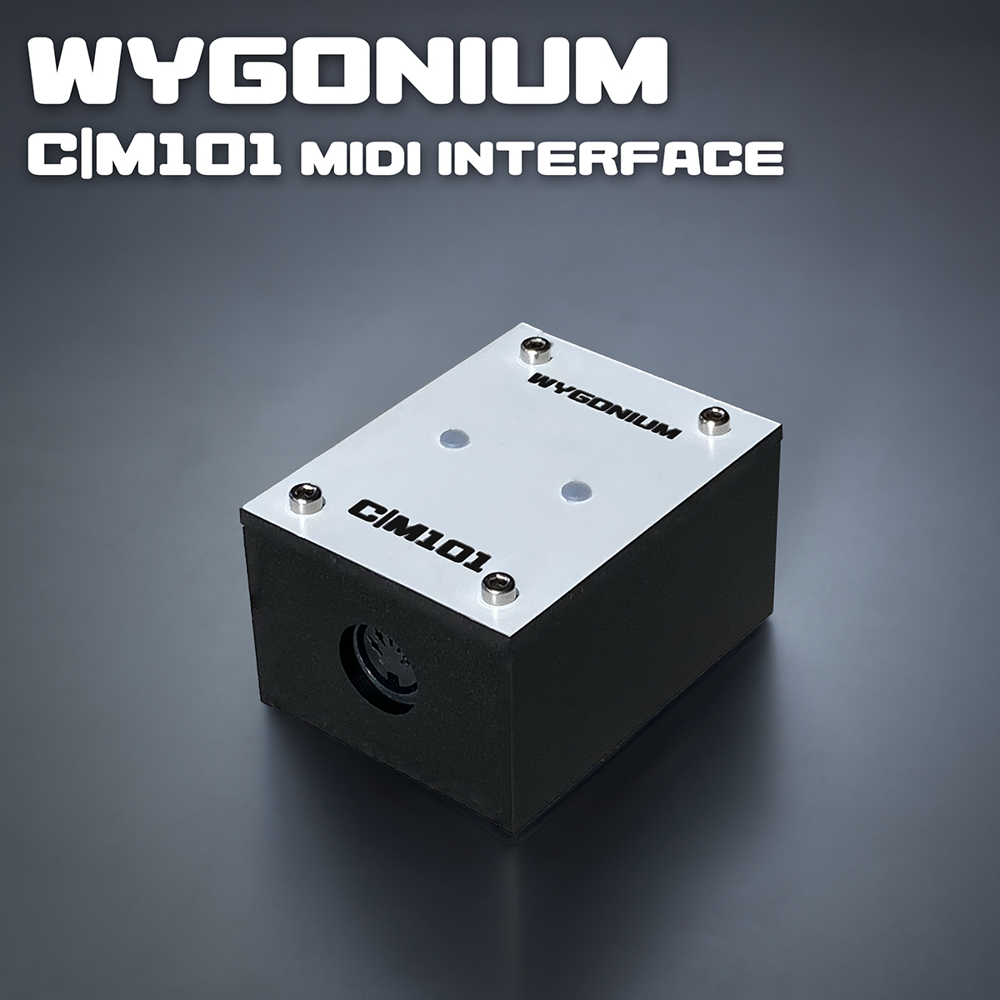
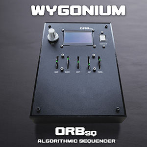

# Wygonium ORBsq Algorithmic Sequencer

## Info

- Orbital path through a deterministic multi-dimensional noise field
- Variable-speed drifting creates ever-evolving patterns
- Adjustable step count from 2-16 for polyrhythmic sequences
- Selectable step durations in tempo-based note lengths
- Algorithmic filtering of steps:
    - Two-dimensional noise +/-
    - Euclidean
- MIDI clock / start / stop output

## Demo Video

<iframe width="560" height="315" src="https://www.youtube.com/embed/EimomUzH16w?si=oPylQPDrMRVcz6Y0" title="YouTube video player" frameborder="0" allow="accelerometer; autoplay; clipboard-write; encrypted-media; gyroscope; picture-in-picture; web-share" referrerpolicy="strict-origin-when-cross-origin" allowfullscreen></iframe>

## Details

#### Hardware 

- Teensy 4.1
- 2.42" OLED display
- 5x Bourns 20mm 10K illuminated sliders
- 1x Omron Electronics tactile switch
- 1x I2C rotary encoder
- Jacks:
    - 1x RJ45 Ethernet
    - 1x 2.1mm DC power
- 1x Power switch
- 1x 5V power regulator
- Several custom PCBs
- Various passives

#### Software

- Standard Arduino/Teensy libraries
- FastLED implementation of Perlin Noise

## The ORBsq Story

### Variations on a(n Algorithmic) Theme

When I was very young I received two presents that shaped my future: an Atari 2600 with the Basic Programming cartridge (sensible parents) and an old, beat-up electric guitar (not-so-sensible brother-in-law). 

Since then, I’ve always combined programming and music in everything I do, especially when it comes to learning new technologies. Typically I pick a music-based goal, and try to use the new tech skill to achieve it; I don’t have to figure out much if anything on the music side, I have a reference for if and how I’m making progress, and in the end I have something that makes music that others can enjoy! Hopefully. 😉

#### The Theme

Several years ago, I got immersed in the world of modular synths - individual hardware "modules" that perform (usually) a single function, that interconnect to create larger music synthesizers. A module could be an oscillator, a filter, a logic control, a sequencer, etc. Though modular synths go back decades, there was a new wave of bespoke modules being made, buoyed by a very DIY-oriented community and a hardware format known as Eurorack. These modules used maker-friendly voltages to generate and control the signals that create and modify sound; voltages in the range of small microprocessors, like Arduino and Teensy, which I was very familiar with. 

At the same time, I was using pen plotters to make algorithmic art, and machines to make said art, sometimes using an algorithm called “Perlin Noise”. You know the computer graphic generated ocean waves or clouds you might see in movies or video games? They are usually based on Perlin noise (or variations like Simplex noise or the unencumbered-by-patents OpenSimplex).

I had already made robot-like machines that interfaced with synth modules, but I wanted to learn to make my own Eurorack module. I decided to bridge the gap between plotter art and music by making a sequencer module that used OpenSimplex noise to algorithmically generate the control voltages.

I iterated over multiple versions, each time learning new skills, working with new components, designing and manufacturing PCBs, and getting ad-hoc UX testing from my modular synth friends. 
I named the sequencer “OrbWeaver” in honor of the spider of the same name that we have all around our property, and as the sequencer generates a path that weaves in an orbital fashion around a user-defined point and radius within the OpenSimplex noise field. This orbiting path allows the sequence to start and end at the same place, regardless of the number of steps. 

My module generated control voltages from this path through the noise that could be plugged into any other module - to create musical notes, to adjust parameters of a filter, or modulate anything the synth player desired. I got fancy and added an ability to filter out steps from the sequence, also based on the algorithm, and inputs to change sequence parameters from other modules.

I made one "final" prototype and gave it to a good friend. Then I moved on.

#### The Theme, Var 2

As this new wave of modular synthesis grew rapidly during COVID lock-down, software-based modular synth ecosystems emerged, allowing the same expansive synthesis options in just the space of a laptop. One of these was/is called VCV Rack, which also maintained the community-oriented culture by being open source and providing a robust SDK for developing custom modules. 

It seemed natural, at least to me, to learn how to port my hardware sequencer module to a software version. This allowed me to more-easily extend and enhance my module without needing to source new parts, design additional circuits, or manufacture interface panels. It also afforded me opportunities to distribute and possibly sell my virtual module. 

With this variation, I was able to add in the display I wanted in my hardware version but would have been cost prohibitive. I also doubled the number of generators from the algorithm and expanded the range of output signals.

I uploaded everything to GitHub, packaged everything for eventual submission to the VCV Rack library, then moved on.

#### The Theme, Var 3

When I made my friend the first Wygonium synthesizer kit in the fall of 2023, it was instinctual that I built it in a modular fashion, giving me an opportunity to use it as a platform for continuing exploration of both tech and interaction. One of the things I knew I’d eventually make for it was—you guessed it—a version of my OrbWeaver sequencer. 

Combining components left over from earlier hardware explorations, my modular synth version, and the hardware and software design language of the Wygonium (and also left-over parts), I spent this spring designing and making the ORBsq!

Of course I couldn’t make something without learning some new things in the process. 

First, most all modern stand-alone sequencers also control other hardware, at the very least to start and stop other hardware sequencers. Mine should, too! To add this “table stake” capability, I needed to learn how to add a MIDI output circuit, and send appropriate sequencer-related MIDI data, like clock timing.

I had created filtering of steps based on the same algorithm that generated the notes, but wanted to add another popular modular synth feature: Euclidean sequences. This algorithm allows for specifying the number of notes per the number of steps, and spaces them equally, filtering the rest.

Finally, I also wanted to add a feature to the core Wygonium GB01 synth that I enjoyed from modular - mapping the incoming signals to musical scales, like Major, Minor, Blues, etc. Learning how to program this would make the ORBsq more musically interesting and useful, and offer new creative possibilities for user-performed input.

#### Finale

Though the algorithmic patterns seem simple, through the various inputs, adjustments, and filters, one can generate very complex patterns that can evolve over time, but always weaving back around to where it started.

Kind of like how me and tech and music all circle around each other, coming together from time to time, but always in close orbit. What are the things in your life that you always come back to for inspiration and learning?

__________

<table align="center">
    <tr valign="top">
        <td align="center" width="150px" valign="top">
<h4 id="gb01-synth"><a href="/Wygonium-Info/WygoniumGB01.html">GB01 Synth</a></h4>
</td>
        <td align="center" width="150px" valign="top">
<h4 id="crb-ribbon-controller"><a href="/Wygonium-Info/CRBController.html">C|RB Ribbon Controller</a></h4>
</td>
        <td align="center" width="150px" valign="top">
<h4 id="m101-midi-input"><a href="/Wygonium-Info/WygoniumM101.html">M101 MIDI Input</a></h4>
</td>
        <td align="center" width="150px" valign="top">
<h4 id="orbsq-algorithmic-sequencer"><a href="/Wygonium-Info/WygoniumORBsq.html">ORBsq Algorithmic Sequencer</a></h4>
</td>
    </tr>
</table>
